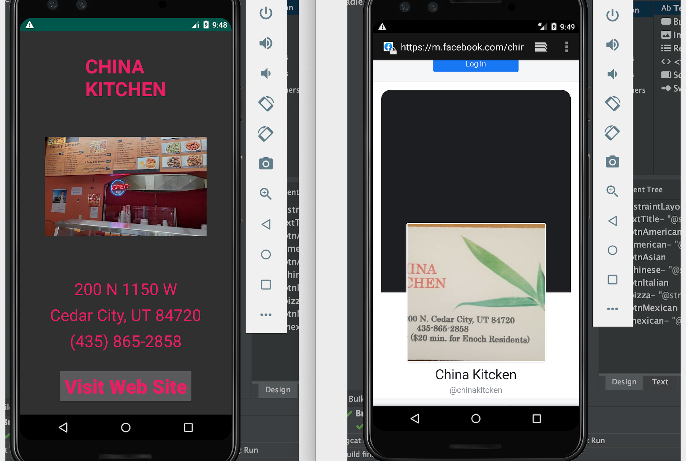

## Final Project For CSCI 1120 at Southwest Tech, Cedar City, Utah 84720.

## Synopsis
My goal was to develope a Food Finder application for those workers on their lunch break giving them a choice of cuisine and a list of nearby locations.

## Motivation
The Introduction to Android Applications book was an introduction to developing applications with Android Studio 3.4.2.  It covered basic topics such as changing activities, using buttons and processing basic user input.  This is the Final Project for that class.

## How to Run
The application folder itself was too large for GitHub to upload to a repository so this folder only contains the main folder files in the appplications src folder.  To run this application please create a new blank activity and modify/replace the appropriate files in Android Studio 3.4.2.  I can also be reached by email for the 200 MB zip file at lister.cha9530@stu.stech.edu.

## Code Sample
'''
public class MainActivity extends AppCompatActivity {

    @Override
    protected void onCreate(Bundle savedInstanceState) {
        super.onCreate(savedInstanceState);
        setContentView(R.layout.activity_main);

        // Buttons
        ImageButton btnAmerican = findViewById(R.id.btnAmerican);
        ImageButton btnChinese = findViewById(R.id.btnAsian);
        ImageButton btnItalian = findViewById(R.id.btnItalian);
        ImageButton btnMexican = findViewById(R.id.btnMexican);

        // Listeners
        btnAmerican.setOnClickListener(new View.OnClickListener() {
            @Override
            public void onClick(View view) {
                startActivity(new Intent(MainActivity.this, AmericanCuisine.class));
            }
        });
'''
'''
    <TextView
        android:id="@+id/txtTitle"
        android:layout_width="wrap_content"
        android:layout_height="wrap_content"
        android:layout_marginTop="50dp"
        android:text="@string/txtTitle"
        android:textAllCaps="true"
        android:textColor="#03A9F4"
        android:textSize="50sp"
        android:textStyle="italic"
        app:fontFamily="sans-serif-condensed"
        app:layout_constraintEnd_toEndOf="parent"
        app:layout_constraintHorizontal_bias="0.5"
        app:layout_constraintStart_toStartOf="parent"
        app:layout_constraintTop_toTopOf="parent" />

    <ImageButton
        android:id="@+id/btnAmerican"
        android:layout_width="175dp"
        android:layout_height="175dp"
        android:layout_marginStart="25dp"
        android:layout_marginLeft="25dp"
        android:layout_marginTop="60dp"
        android:layout_marginEnd="16dp"
        android:layout_marginRight="16dp"
        android:contentDescription="@string/image1"
        android:scaleType="fitCenter"
        app:layout_constraintEnd_toStartOf="@+id/btnAsian"
        app:layout_constraintStart_toStartOf="parent"
        app:layout_constraintTop_toBottomOf="@+id/txtTitle"
        app:srcCompat="@drawable/cheeseburger" />
'''
